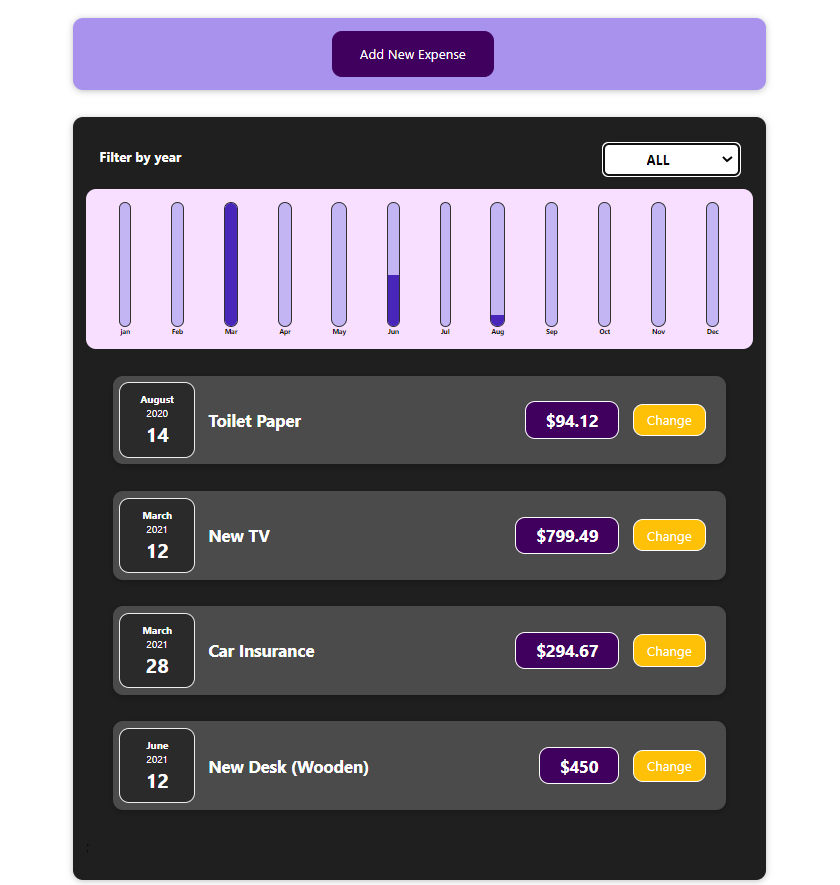

# Expenses Demo React Project
> It is a demo project to dive into all the basics you need to know to build any kind of React app and explore all the base features.
>- Video demo [_here_](https://drive.google.com/file/d/1Bkm_J9Ny9WnpzOcwXEYRKu7UyrEG55Wp/view?usp=share_link).

## Table of Contents
* [General Info](#general-information)
* [Technologies Used](#technologies-used)
* [Features](#features)
* [Screenshots](#screenshots)
* [Project Status](#project-status)

## General Information
- It is demo project i have applied and it was built by Maximilian Schwarzmüller in his react course on udemy.
- It is about How to dive into all the basics of react
- Dealing with components, props and states.
- Knowing all the core syntax,specifically also going to learn about a feature called JSX or a special syntax called JSX.

## Technologies Used
- Front End - HTML5 , CSS3 , Reactjs

 
## Features

- explore all the base features 
- how to build component-driven user interfaces.
- So how to build user interfaces by embracing a concept called components
- Add Expenses and showing them in the chart

## Screenshots

## Project Status
Project is: _complete_ 

